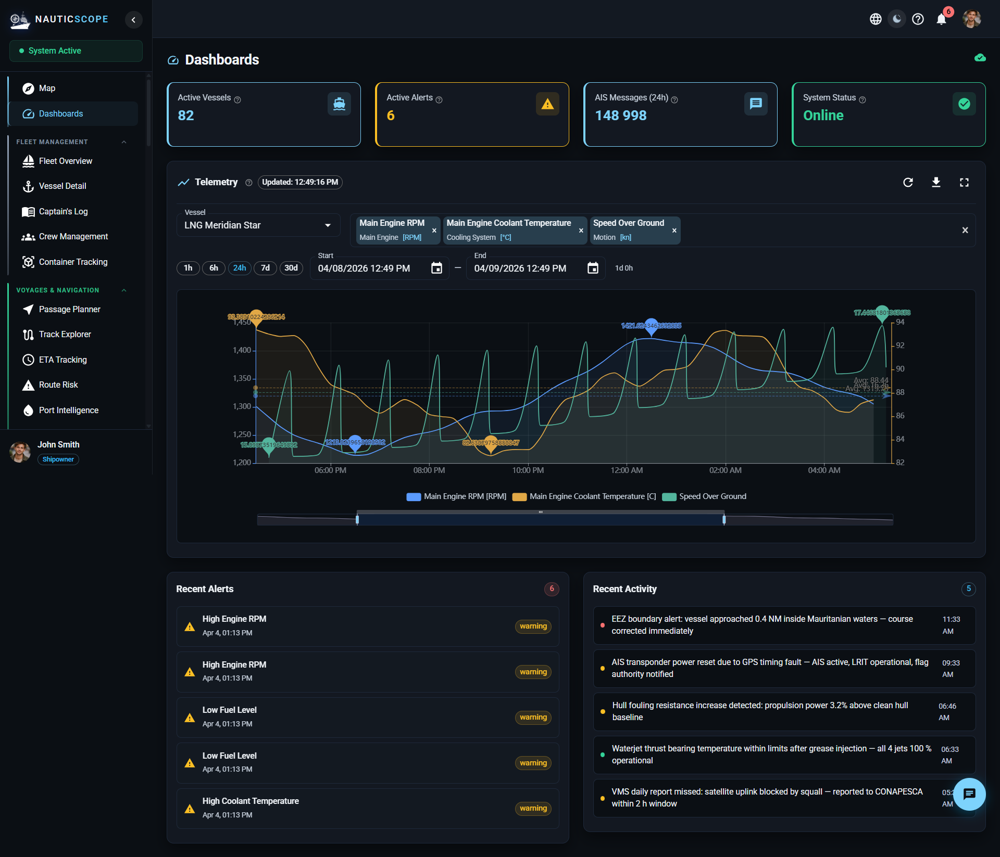

# realtimehooks – SSE Real-Time Data Hooks & State Management

A standalone TypeScript/React module for EventSource (SSE) streams,
multi-stream composition, and Zustand state management with per-user persistence.

## Overview

<p align="center">
  
</p>

## Features

- EventSource with exponential backoff reconnection (1s → 30s, unlimited retries)
- Multi-stream composition: 4 independent SSE streams unified into one hook
- `vesselSetKey` optimization: prevents structural layer rebuilds on position ticks
- Gap pre-computation for time-series trail data (O(n) once at ingestion, O(1) incremental)
- Zero-copy batch append: same state reference returned when no data changed
- Zustand `persist` middleware with per-user isolated storage
- Weather routing hook (`useIsochrone`) with utility formatters

## Tech Stack

| Layer | Technology |
|---|---|
| Language | TypeScript (strict) |
| Hooks | React 18 |
| State | Zustand 5 + persist middleware |
| Real-time | EventSource (SSE) |
| Testing | Vitest + React Testing Library |
| Build check | `tsc --noEmit` |

## Installation

```bash
npm install zustand react
# copy src/ into your project or install as a local package
```

## Usage

### Single-vessel telemetry stream

```tsx
import { useTelemetryStream } from '@itiana/realtimehooks';

function VesselPanel({ vesselId }: { vesselId: string }) {
  const { data, connected, error, reconnect } = useTelemetryStream({
    vesselId,
    tagCodes: ['ME_RPM', 'ME_LO_TEMP', 'NAV_SOG'],
    intervalSeconds: 5,
    baseUrl: 'https://api.example.com',
  });

  return (
    <div>
      <span>{connected ? 'Live' : 'Reconnecting...'}</span>
      {data.map(v => <div key={v.tagCode}>{v.tagCode}: {v.value}</div>)}
    </div>
  );
}
```

### Unified dashboard (4 streams)

```tsx
import { useDashboardRealtime } from '@itiana/realtimehooks';

function Dashboard({ vesselId }: { vesselId: string | null }) {
  const {
    telemetry,
    alerts,
    alertSummary,
    connections,
    errors,
    reconnectAll,
  } = useDashboardRealtime({
    vesselId: vesselId ?? undefined,
    tagCodes: ['ME_RPM', 'TANK_FO_PORT'],
    enableTelemetry: !!vesselId,
    enableAlerts: true,
    enableAlertSummary: true,
  });

  const isFullyConnected = Object.values(connections).every(Boolean);
  const criticalCount = alertSummary?.critical ?? 0;

  return (
    <div>
      <button onClick={reconnectAll} disabled={isFullyConnected}>
        Reconnect
      </button>
      <span>Critical alerts: {criticalCount}</span>
    </div>
  );
}
```

### Map store – real-time trail updates

```tsx
import { useMapStore } from '@itiana/realtimehooks';

// On SSE position tick:
const { batchAppendTrailPoints, vesselTrailGaps } = useMapStore.getState();

batchAppendTrailPoints([
  { vesselId: 'v-001', point: { latitude: 55.1, longitude: 20.1, timestamp: '...' } },
  { vesselId: 'v-002', point: { latitude: 48.9, longitude: 2.3, timestamp: '...' } },
]);

// Gap indices already computed – use directly in render:
const gaps = vesselTrailGaps.get('v-001') ?? [];
```

### Per-user dashboard persistence

```tsx
import { useDashboardStore } from '@itiana/realtimehooks';

// On login:
useDashboardStore.getState().setCurrentUser(userId);

// Save widget layout:
useDashboardStore.getState().updateDashboardLayout('main', newLayouts);

// On logout:
useDashboardStore.getState().setCurrentUser(null);
```

### Weather routing

```tsx
import { useIsochrone, getWeatherSeverity } from '@itiana/realtimehooks';

function RoutePanel() {
  const { data, loading, calculate } = useIsochrone({
    baseUrl: 'https://ml-api.example.com',
  });

  const handleRoute = () =>
    calculate({
      vessel_id: 'v-001',
      origin: [52.20, 2.80],
      destination: [40.71, -74.00],
      departure_time: new Date(),
      base_speed_knots: 15,
    });

  const severity = data
    ? getWeatherSeverity(data.max_wave_height_m, data.max_wind_speed_ms)
    : null;

  return (
    <div>
      <button onClick={handleRoute} disabled={loading}>Calculate Route</button>
      {severity && <span>Weather: {severity}</span>}
    </div>
  );
}
```

## Project Structure

```
realtimehooks/
  src/
    hooks/
      useTelemetryStream.ts   SSE + exponential backoff (vessel + fleet)
      useAlertStream.ts       Alert + AlertSummary SSE streams
      useDashboardRealtime.ts Multi-stream composition (4 SSE → 1 hook)
      useIsochrone.ts         Weather routing REST hook + utilities
      index.ts
    store/
      mapStore.ts             Positions, trails, gap pre-computation, timeline
      dashboardStore.ts       Persist middleware, per-user widget layouts
      index.ts
    types/
      index.ts                All domain interfaces
    index.ts
  __tests__/
    useTelemetryStream.test.ts
    mapStore.test.ts
  package.json
  tsconfig.json
  vitest.config.ts
```

## Running Tests

```bash
npm install
npm test
```

## Key Implementation Notes

**`vesselSetKey`**: computed from sorted vessel IDs. Changes only when vessels are
added/removed, not on position updates. Use as a stable React `useMemo` dependency
to avoid rebuilding expensive layers (geofences, heatmaps) on every SSE tick.

**Gap pre-computation**: `computeGapIndices` identifies teleport gaps (distance > 50 km
between consecutive trail points). Computed O(n) once on store write. For single-point
batch appends, updated O(1) incrementally. Render code reads pre-computed indices – no
distance math per frame.

**Zero-copy batch append**: `batchAppendTrailPoints` allocates new Maps only when data
actually changes. All-duplicate tick → same state reference → Zustand skips subscriber
notifications.

**Callback refs**: `onData` / `onError` are captured in refs so callback identity
changes never trigger SSE reconnects.


## Release Status

**0.1.0-alpha** - API is stabilising but not yet frozen. Minor versions may include breaking changes until `1.0.0`.

---

## License

MIT - see [LICENSE](./LICENSE)